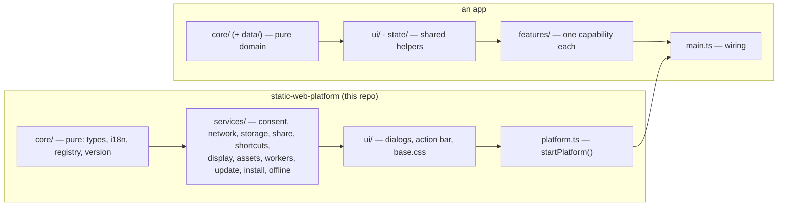

# static-web-platform

The shared base of every static web app built with the `static-web-app` skill. Each
app keeps its own content, features and (optionally) framework. The platform provides
everything that must behave the same everywhere:

- **Local-only by default:** no request to another server without the user's consent
  (accessible dialog; "ask every time" with the exact value for user input;
  decisions revocable in *Privacy*), with a generated Content-Security-Policy as the
  hard ceiling.
- **Two outputs from one source:** an installable app (PWA, offline, updates itself)
  and a single-file HTML download that can check for updates (after consent).
- **Accessibility built in:** dialogs, a single-key shortcut switch (WCAG 2.1.4), a
  theme choice, focus kept visible under sticky headers, and phone rules (16px fields,
  44px targets).
- **No data in the address bar:** shared links only through a warned, explicit
  *Share* action.
- **The `swp` command:** build (architecture check, type check, bundle, assembly),
  `check`, `verify` (byte-for-byte reproducibility), `gate` (security, consent,
  accessibility, keyboard, mobile, URL, single file, offline — on the first screen
  and on every app scenario), `serve`, `icons`.

## Architecture



Dependencies point inward only. The platform never imports app code. Apps use only
the public API (`src/index.ts`), and their own layer rules are enforced by
`swp build` (`tools/swp_tools/arch.py`).

| Platform layer | May use | Must not |
|---|---|---|
| `core/` | nothing | the DOM, the network, storage |
| `services/` | `core/`, browser APIs | render UI (questions go through injected functions) |
| `ui/` | `core/`, `services/`, the DOM | contain decision logic |
| `platform.ts` | everything above | — |

## Using it in an app

Each app includes this repository as a **Git submodule** in `platform/`, pinned to a
release, and installs it through npm from that folder:

```bash
git submodule add https://github.com/<owner>/static-web-platform.git platform
git -C platform checkout v1.3.1
```
```jsonc
// package.json of the app
"dependencies": { "static-web-platform": "file:platform" },
"devDependencies": { "typescript": "7.0.2", "esbuild": "0.28.2", "@types/node": "24.19.1" }
```
Peer ranges: TypeScript `>=6 <8` (7 by default; 6 for Svelte apps, because
`svelte-check` 4.x supports TypeScript up to 6), and esbuild `0.28` (optional when the
app has its own bundler). In CI, `actions/checkout` needs `submodules: true`.

### Public API (`import … from "static-web-platform"`)

```ts
const platform = startPlatform<MyOptions>({ strings: { fr: { … } } });   // first, once
platform.site                       // SiteConfig: id, title, lang, mode ("site" | "single"), version, options…
platform.t("key", { n: 3 })         // UI strings (platform + app), missing key = error
platform.store / sessionStore       // prefixed storage, never throws
platform.net.fetch(url, init, { disclose })    // consent-gated; null when refused
platform.net.image(img, url, fallback)         // consent-gated image
platform.consent.request(origin)    // before enabling a library that loads its own resources
platform.share.offer(payload, items)           // warned share link (copied, never in the address bar)
platform.share.incoming             // data of an opened share link (already removed from the URL)
platform.shortcuts.add({ key: "/", description, run })   // single-key shortcuts (user can turn off)
platform.assets.fetch("data/big.json")         // optional hosted-site files; null in the single file
platform.worker("solver")           // Web Worker, same call in both outputs
platform.setStatus(text, notice?)   // announced status line
platform.supportLink()              // "☕ Buy me a coffee" link (site.json "support"), or null; the app places it
createRegistry<Spec, Out, Ctx>()    // one renderer per content type
el(tag, props, …children), byId(id)            // small DOM helpers
```

### Page contract (`src/index.html`)
`<!-- BUILD:HEAD -->`, `<!-- BUILD:BODY -->`, an element `#app-actions` (the platform
adds Install / Download / Check for updates / Privacy / Accessibility / status),
`<html lang>`, a skip link, and `data-swp-sticky` on any sticky header (the platform
keeps focused elements visible below it).

### `src/site.json`
| Key | Meaning |
|---|---|
| `id`, `title`, `shortName`, `lang`, `themeColor` | identity (storage prefix, manifest, `<title>`) |
| `siteUrl` | production URL ("" until known: no update check in the single file) |
| `downloadName` | file name of the single-file download |
| `entry` | bundler entry (default `src/main.ts`) |
| `netOrigins` | external servers: `{ "https://host": { "directive": "img-src", "purpose": "…", "scope": "origin"\|"request", "referrerPolicy": "no-referrer"\|"origin"\|"strict-origin" } }` |
| `options` | the app's own options (typed by the app) |
| `modes` | `["identifiers", "files"]`: `core/` sub-folders isolated from each other (other sub-folders import freely) |
| `themeSwitch` | offer a light / dark / system choice in *Accessibility* |
| `support` | `{ "url": "https://buymeacoffee.com/…" }`: "support the author" link, placed by the app with `platform.supportLink()` |
| `assets`, `precacheAssets` | optional files, hosted site only (globs relative to `src/`); cached offline only if `true` |
| `workers` | `{ "name": "src/workers/name.ts" }` |
| `appBuild` | `{ "command": [...], "outDir": "build/app", "inputs": ["vite.config.ts"] }`: own bundler |
| `typecheck` | `{ "command": [...] }`: replaces `tsc` (e.g. `svelte-check`) |

### The app build contract (framework freedom)
`swp build` needs, in one folder:
- `app.js`: **one self-contained script** (all imports bundled, platform included),
  IIFE;
- `app.css`: optional;
- `workers/<name>.js`: one self-contained script per declared worker.

By default esbuild produces them from `entry` and `workers`. TypeScript, JSX (React,
Preact) and CSS imports work out of the box; images and fonts referenced from CSS
(e.g. a library stylesheet such as `leaflet.css`) are embedded as `data:` URLs, so
they also work in the single file. With your own bundler, inline them too (Vite:
`build.assetsInlineLimit`). Frameworks that need `eval` at run time
are not allowed (the CSP forbids it).

**Verified frameworks** (full gate, byte-for-byte rebuild):
- none (plain TypeScript);
- Preact 11 (esbuild);
- **Svelte 5 + Vite 8**, with TypeScript 6 and `svelte-check` 4.7.6 as the type check:

```ts
// vite.config.ts (Svelte) — honours the contract; listed in appBuild.inputs
import { svelte } from "@sveltejs/vite-plugin-svelte";
import { defineConfig } from "vite";
export default defineConfig({
  plugins: [svelte()],
  resolve: { preserveSymlinks: true },     // node_modules/... paths, no local path in output
  build: {
    outDir: process.env.SWP_OUT_DIR ?? "build/app", emptyOutDir: true,
    minify: false, sourcemap: false, cssCodeSplit: false,   // readable, auditable
    lib: { entry: "src/main.ts", formats: ["iife"], name: "app", fileName: () => "app.js", cssFileName: "app" },
  },
});
```
```jsonc
// site.json
"appBuild": { "command": ["node_modules/.bin/vite", "build"], "outDir": "build/app",
              "inputs": ["vite.config.ts", "svelte.config.js"] },
"typecheck": { "command": ["node_modules/.bin/svelte-check", "--tsconfig", "./tsconfig.json", "--fail-on-warnings"] }
```
Vue is not verified yet.

**Dev servers:** `npx swp build --dev` writes `config.js` (mode `"dev"`: no service
worker, no install/download) and `base.css` into `build/dev/`. Serve that folder as static files (e.g. Vite `publicDir`) and load both
from the dev page, before the app.

### TypeScript requirements
`tsconfig.json`: `strict`, `moduleResolution: "bundler"`, `allowImportingTsExtensions`
(imports end in `.ts`), `verbatimModuleSyntax`, `erasableSyntaxOnly`, and
`resolveJsonModule` (datasets). These rules let Node's test runner execute the
TypeScript directly (`node --test`): no `enum`, no `namespace`, no constructor
parameter properties, and type-only imports written `import type`.

`src/core/` is type-checked a second time **without the DOM library**; besides
ECMAScript it may use only `TextEncoder`, `TextDecoder`, `structuredClone` and
`crypto` (`getRandomValues`, `randomUUID`, `subtle.digest`) — the APIs pages,
workers and Node share (`tools/swp_tools/core-runtime.d.ts`).

**Node:** `mise.toml` pins an exact version (`node = "24.21.0"`); `swp build` refuses
another one, because npm versions differ in how they link package binaries.

## Commands

From the app's root, with Node on PATH (`mise exec -- …`):

| Command | Does |
|---|---|
| `npx swp build` | architecture check, type check (+ `core/` without the DOM), bundle, assemble `public/` |
| `npx swp build --dev` | only `config.js` + `base.css` for a dev server |
| `npx swp check` | `public/` is up to date with `src/` (no Node needed) |
| `npx swp verify` | `public/` is byte-for-byte a fresh rebuild |
| `npx swp gate` | the full verification gate (needs `scenarios.json`) |
| `npx swp serve` | serve `public/` with its `_headers`, imitating Cloudflare's "pretty URLs" (`/x.html` → `/x`) |
| `npx swp icons` | render the PNG icons from `src/icons/icon.svg` |

## Developing the platform

```bash
mise exec -- npm ci
mise exec -- npm run typecheck
mise exec -- npm test          # core, consent, share (Node test runner); build tools, arch (unittest)
```
End-to-end behaviour is checked in the apps' CI (`npx swp gate`). Before tagging, run
one app (and the Svelte example, if the build contract changed) through
`swp build` + `swp gate`.

### First release (one time)
1. Commit the release (`feat: …`).
2. `git tag -a vX.Y.Z` (never move a tag afterwards).
3. Create the GitHub repository `static-web-platform`; then
   `git remote add origin …`, then `git push -u origin main --tags`.
4. Public repository: apps' CI fetches the submodule with `submodules: true`.
   Private repository: apps fetch it with a read-only deploy key in a separate step
   (the `static-web-app` skill, "Private platform: CI access").

### Every release
Update `CHANGELOG.md`, then bump `version` in `package.json` (semantic versioning:
breaking API, page contract or build contract = major), commit, and tag `vX.Y.Z`.
Apps update through Dependabot (`gitsubmodule`) or by hand, then rebuild `public/`
and run the gate.

## Development & AI use

Generative AI was used in this project mainly to assist during the coding phase. The
original ideas and the overall structure are the owner's.
